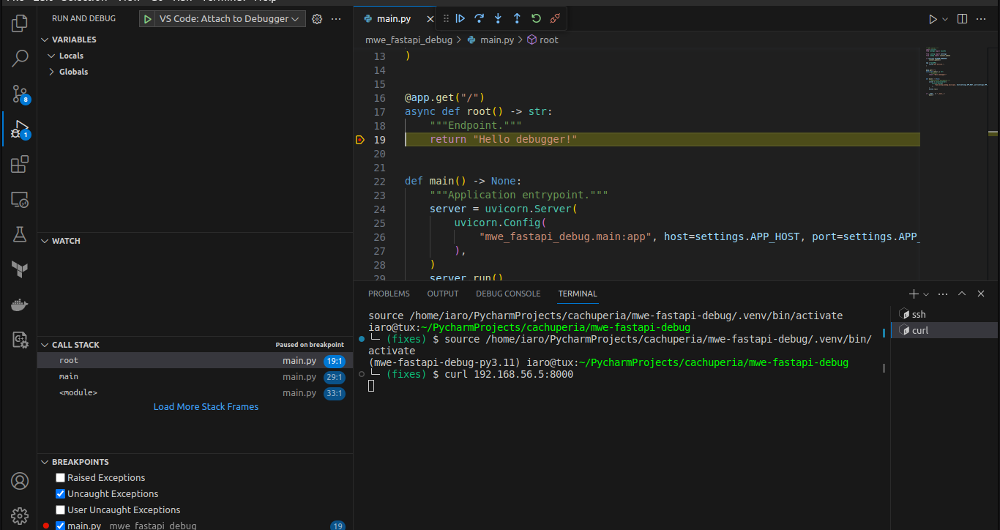
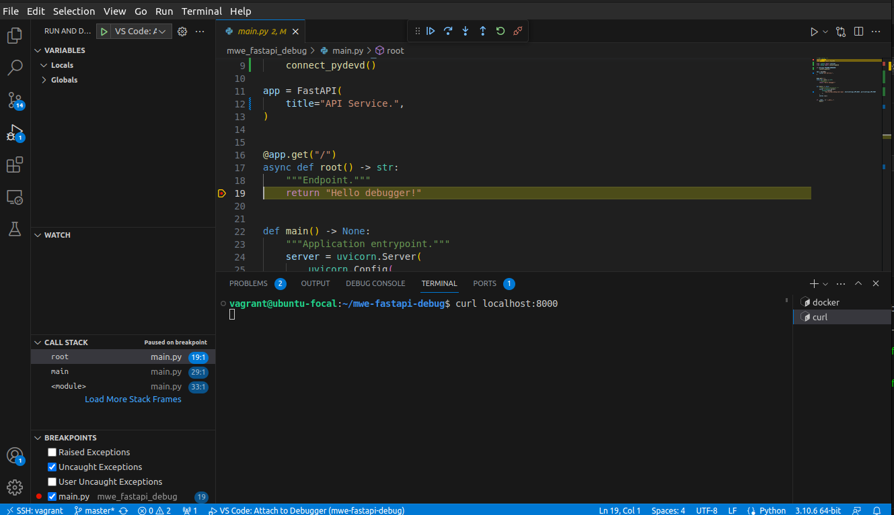
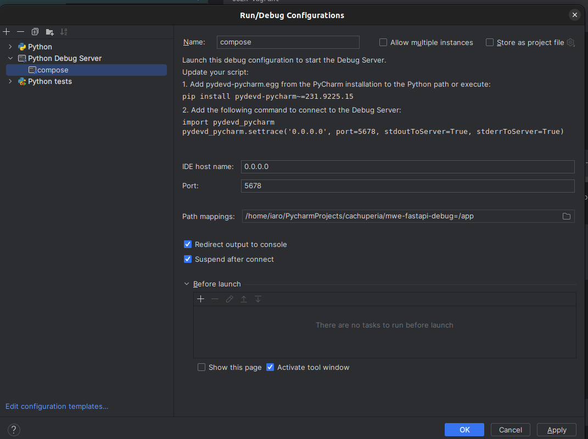
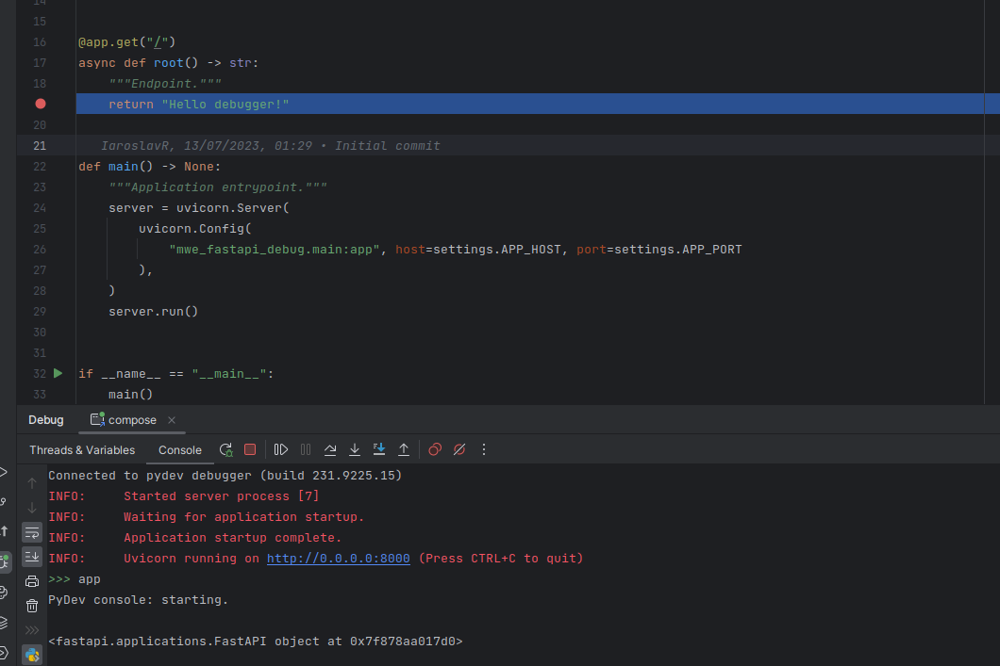

# mwe-fastapi-debug

IDE configuration for debugging an application running inside a remote Docker Compose stack. 

In this example, we will be working with an Ubuntu 20.04 virtual machine, but any instance with SSH access and Docker installed can be used as remote.

## Clone repo and start VM 

```shell
# Local shell
git clone https://github.com/cachuperia/mwe-fastapi-debug.git
cd mwe-fastapi-debug
vagrant up
```

## Visual Studio

### Local shell(debugger port will be forwarded from remote) configuration

Execute

```shell
# Local shell

# SSH credentials and debugger port for forwarding. 
# Please change these values to your own if you need to connect to a different instance.
DEBUGGER_PORT=5678
USER=vagrant
HOST=192.168.56.5
KEY_PATH=.vagrant/machines/focal64/virtualbox/private_key
SSH_OPTIONS="-o StrictHostKeyChecking=no -o UserKnownHostsFile=/dev/null -S /tmp/%r@%h-%p"

ssh -L ${DEBUGGER_PORT}:localhost:${DEBUGGER_PORT} ${USER}@${HOST} -i ${KEY_PATH} ${SSH_OPTIONS}
```

### Remote SSH configuration

Copy `vagrant` instance configuration to the SSH `config` file

```
# ~/.ssh/config
Host vagrant
    # Please change these values to your own if you need to connect to a different instance
    HostName 192.168.56.5
    User vagrant
    # Please change path to the key to your own
    IdentityFile /path/to/mwe-fastapi-debug/.vagrant/machines/focal64/virtualbox/private_key
    ControlPath /tmp/%r@%h-%p
    StrictHostKeyChecking no
    UserKnownHostsFile /dev/null    
```

and open `vagrant` connection in the Remote Explorer.

### Debugging

Execute

```shell
# Remote shell
cd mwe-fastapi-debug
docker compose -f docker-compose.debug-vscode.yml up
```

start `VS Code: Attach to Debugger` [debug](https://code.visualstudio.com/docs/python/debugging) [configuration](.vscode/launch.json), set breakpoint and send API request.

#### Local shell configured



```shell
# Local shell
curl 192.168.56.5:8000
```

#### Remote SSH configured



```shell
# Remote shell
curl localhost:8000
```

## PyCharm

### Local shell(debugger port will be forwarded to remote) configuration

Create configuration for `Python Debug Server`,  host - `0.0.0.0`, port - `5678`, mapping - `/path/to/project:/app`



Start `Python Debug Server`.

Execute

```shell
# Local shell

# SSH credentials and debugger port for forwarding. 
# Please change these values to your own if you need to connect to a different instance.
DEBUGGER_PORT=5678
USER=vagrant
HOST=192.168.56.5
KEY_PATH=.vagrant/machines/focal64/virtualbox/private_key
SSH_OPTIONS="-o StrictHostKeyChecking=no -o UserKnownHostsFile=/dev/null -S /tmp/%r@%h-%p"
ssh -R 0.0.0.0:${DEBUGGER_PORT}:localhost:${DEBUGGER_PORT} ${USER}@${HOST} -i ${KEY_PATH} ${SSH_OPTIONS}
```

Copy `pydevd-pycharm.egg` to the remote

```shell
# Local shell
# Change path to debugger egg to yours
PYCHARM_DEBUGGER=/path/to/PyCharm/debug-eggs/pydevd-pycharm.egg 
scp ${PYCHARM_DEBUGGER} ${USER}@${HOST}:/home/${USER}/mwe-fastapi-debug/
```

### Debugging

Execute 

```shell
# Remote shell
cd mwe-fastapi-debug
docker compose -f docker-compose.debug-pycharm.yml up
```

set breakpoint and send API request



```shell
# Local shell
curl 192.168.56.5:8000
```

## Code Modification with "Hot (No Build) Reload"

Please modify the service code either locally or remotely.

Ensure that your changes is synchronized with the remote folder [mounted](./docker-compose.debug.yml#L7) to the `/app` folder, if you are working locally.

Next, restart the `docker-compose.debug-<IDE name>.yml` stack.

If you are working in a Remote SSH VS Code session, please ensure that your remote changes are pushed to the GitHub upon task completion.

## Cleanup

### Close SSH Connection

```shell
# Local shell
ssh -S /tmp/%r@%h-%p -O exit ${USER}@${HOST}
```

### Stop VM 

```shell
# Local shell
vagrant halt
```

### Destroy VM 

```shell
# Local shell
vagrant destroy -f
```
